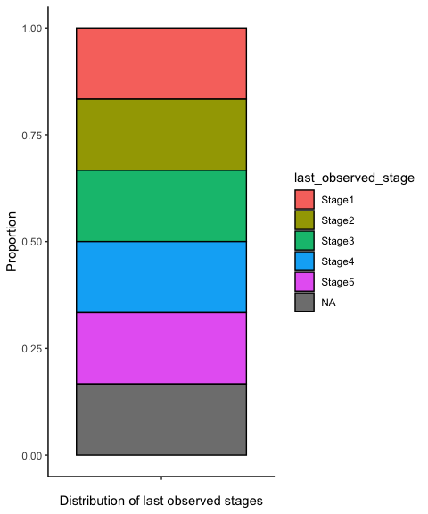

<!-- README.md is generated from README.Rmd. Please edit that file -->

# stagetrackr

<!-- badges: start -->
<!-- badges: end -->

The goal of stagetrackr is to provide a range of tools to optimise
working with data from species which develop through multiple life
stages. It can automatically assign the last observed staged for
individuals in experimental datasheets and plot graphs of: survival
rates through development; distribution of last observed stages with the
ability to specify factors which are separated for the purposes
comparative analysis.

## Installation

You can install the development version of stagetrackr like so:

``` r
install.packages("devtools")
devtools::install_github("EcoHull/stagetrackr")
```

## Usage

The functions in this package are designed to be used in sequence
depending on the questions being answered. But the base data relies on
the recording of the dates that individuals move through developmental
stages.

The first stage of stagetrackr analysis is to use the
`assigned_stages()` function. This function takes the data frame and the
stage order and returns the last observed developmental stage seen in
each row.

``` r
library(stagetrackr)

example_stages = c("Stage1", "Stage2", "Stage3", "Stage4", "Stage5")

example_data = dplyr::tribble(
~ID, ~ Stage1, ~Stage2, ~Stage3, ~Stage4, ~Stage5,
  1, "01/01/2000", NA, NA, NA, NA,
  2, "01/01/2000", "02/01/2000", NA, NA, NA,
  3, "01/01/2000", "02/01/2000", "03/01/2000", NA, NA,
  4, "01/01/2000", "02/01/2000", "03/01/2000", "04/01/2000", NA,
  5, "01/01/2000", "02/01/2000", "03/01/2000", "04/01/2000", "05/01/2000",
  6, NA, NA, NA, NA, NA,
)

assigned_stages = stage_assigning(columns = example_stages, data = example_data)
show(assigned_stages)
#> # A tibble: 6 × 7
#>      ID Stage1     Stage2     Stage3     Stage4     Stage5   last_observed_stage
#>   <dbl> <chr>      <chr>      <chr>      <chr>      <chr>    <chr>              
#> 1     1 01/01/2000 <NA>       <NA>       <NA>       <NA>     Stage1             
#> 2     2 01/01/2000 02/01/2000 <NA>       <NA>       <NA>     Stage2             
#> 3     3 01/01/2000 02/01/2000 03/01/2000 <NA>       <NA>     Stage3             
#> 4     4 01/01/2000 02/01/2000 03/01/2000 04/01/2000 <NA>     Stage4             
#> 5     5 01/01/2000 02/01/2000 03/01/2000 04/01/2000 05/01/2… Stage5             
#> 6     6 <NA>       <NA>       <NA>       <NA>       <NA>     no_stage_found
```

Following the use of `stage_assigning()` a data table can be created
using `last_observed_stage_table()` this functions requires the
specifying of the data frame, the column containing the last observed
stages and a list of the stages in order and returns information about
the stage distribution.

This function is designed to work with the output of `assigned_stages()`
but will alwo work with any dataset with one row per individual and a
column specifying final recorded developmental stage.

``` r

data_table = last_observed_stage_table(data = assigned_stages, last_observed_stage = "last_observed_stage")
show(data_table)
#> # A tibble: 5 × 6
#>   last_observed_stage     n percentage cumulative remaining_n
#>   <fct>               <int>      <dbl>      <int>       <int>
#> 1 Stage1                  1         20          1           5
#> 2 Stage2                  1         20          2           4
#> 3 Stage3                  1         20          3           3
#> 4 Stage4                  1         20          4           2
#> 5 Stage5                  1         20          5           1
#> # ℹ 1 more variable: remaining_percentage <dbl>
```

The `visualisig_survival()` function is designed to work with the output
of `last_observed_stage_table()`. It requires the specification of the
data frame, remaining percentage column and optionally the remaining
number column (if it is not provided it will not show the N value). This
functions generates a bar chart with a bar for each developmental stage
providing details of the remaining percentage (and optionally the N
remaining) at each stage of development.

``` r

visualising_survival(data = data_table, stages = last_observed_stage, remaining_percentage = remaining_percentage, remaining_number = remaining_n)
```


The distribution of the last observed stages can also be visualised.
This used the `visualising_distribution()` function which is designed to
work with the output of the `stage_assigning()` function. This requires
the specification of the data frame, the column containing the assigned
stages, and optionally a factor column. If a factor column is specified,
a new bar will be generated for each factor.

``` r

# No factor visualisation

visualising_distribution(data = assigned_stages, stage = last_observed_stage)
```



``` r

# With factors specified
data_with_factor = dplyr::tribble(
  ~ID, ~ Stage1, ~Stage2, ~Stage3, ~Stage4, ~Stage5, ~last_observed_stage, ~Sex,
  1, "01/01/2000", NA, NA, NA, NA, "Stage1", "Male",
  2, "01/01/2000", "02/01/2000", "03/01/2000", NA, NA, "Stage3", "Male",
  3, "01/01/2000", "02/01/2000", "03/01/2000", NA, NA, "Stage3", "Male",
  4, "01/01/2000", "02/01/2000", "03/01/2000", "04/01/2000", NA, "Stage4", "Male",
  5, "01/01/2000", "02/01/2000", "03/01/2000", "04/01/2000", "05/01/2000", "Stage5", "Male",
  6, NA, NA, NA, NA, NA, "no_stage_found", "Male",
  1, "01/01/2000", NA, NA, NA, NA, "Stage1", "Female",
  2, "01/01/2000", "02/01/2000", NA, NA, NA, "Stage2", "Female",
  3, "01/01/2000", "02/01/2000", "03/01/2000", NA, NA, "Stage3", "Female",
  4, "01/01/2000", "02/01/2000", "03/01/2000", "04/01/2000", "05/01/2000", "Stage5", "Female",
  5, "01/01/2000", "02/01/2000", "03/01/2000", "04/01/2000", "05/01/2000", "Stage5", "Female",
  6, NA, NA, NA, NA, NA, "no_stage_found", "Female"
)

show(data_with_factor)
#> # A tibble: 12 × 8
#>       ID Stage1     Stage2     Stage3    Stage4 Stage5 last_observed_stage Sex  
#>    <dbl> <chr>      <chr>      <chr>     <chr>  <chr>  <chr>               <chr>
#>  1     1 01/01/2000 <NA>       <NA>      <NA>   <NA>   Stage1              Male 
#>  2     2 01/01/2000 02/01/2000 03/01/20… <NA>   <NA>   Stage3              Male 
#>  3     3 01/01/2000 02/01/2000 03/01/20… <NA>   <NA>   Stage3              Male 
#>  4     4 01/01/2000 02/01/2000 03/01/20… 04/01… <NA>   Stage4              Male 
#>  5     5 01/01/2000 02/01/2000 03/01/20… 04/01… 05/01… Stage5              Male 
#>  6     6 <NA>       <NA>       <NA>      <NA>   <NA>   no_stage_found      Male 
#>  7     1 01/01/2000 <NA>       <NA>      <NA>   <NA>   Stage1              Fema…
#>  8     2 01/01/2000 02/01/2000 <NA>      <NA>   <NA>   Stage2              Fema…
#>  9     3 01/01/2000 02/01/2000 03/01/20… <NA>   <NA>   Stage3              Fema…
#> 10     4 01/01/2000 02/01/2000 03/01/20… 04/01… 05/01… Stage5              Fema…
#> 11     5 01/01/2000 02/01/2000 03/01/20… 04/01… 05/01… Stage5              Fema…
#> 12     6 <NA>       <NA>       <NA>      <NA>   <NA>   no_stage_found      Fema…
```

``` r
visualising_distribution(data = data_with_factor, stage = last_observed_stage, factor = Sex)
```


